.NET backend developer. On the side I build **transparent PowerShell alternatives** to closed-source Windows tweaking tools — every script fits on one screen, needs no install, and writes a `.reg` / backup undo before touching anything.

## Latency toolbox

  

| Tool | Replaces | What it does |
|:-----|:---------|:-------------|
| [cpu-parking-disabler](https://github.com/vadyaravadim/cpu-parking-disabler)  | ParkControl, Quick CPU | Unpark all CPU cores |
| [msi-mode-utility](https://github.com/vadyaravadim/msi-mode-utility)  | MSI Util v3 | MSI mode for GPU, USB, network, audio |
| [timer-resolution-utility](https://github.com/vadyaravadim/timer-resolution-utility)  | TimerResolution.exe, ISLC | 0.5 ms timer + `Sleep(1)` benchmark |
| [interrupt-affinity-utility](https://github.com/vadyaravadim/interrupt-affinity-utility)  | GoInterruptPolicy | Pin interrupts to cores, P/E-aware |
| [gamedvr-fso-disabler](https://github.com/vadyaravadim/gamedvr-fso-disabler)  | — | Disable Game DVR &amp; FSO |
| [remove-hidden-devices](https://github.com/vadyaravadim/remove-hidden-devices)  | — | Remove ghost devices from Device Manager |

Every tool follows the same contract: read the script before you run it, undo file written before any change, one command to apply.
